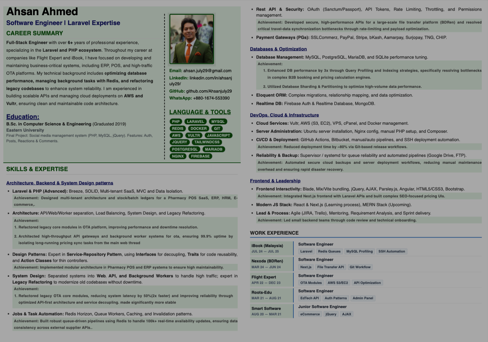

# My CV

This repository contains the code for my personal CV website, built using HTML and CSS. It showcases my professional experience, education, skills, and personal projects in a simple, responsive, and elegant design.

## Preview

<a href="https://ahsanjuly29.github.io/Ahsanjuly29/cv/" target="_blank">click here To view</a>:
      
## License
This project is licensed under the MIT License - see the [LICENSE](LICENSE) file for details.
