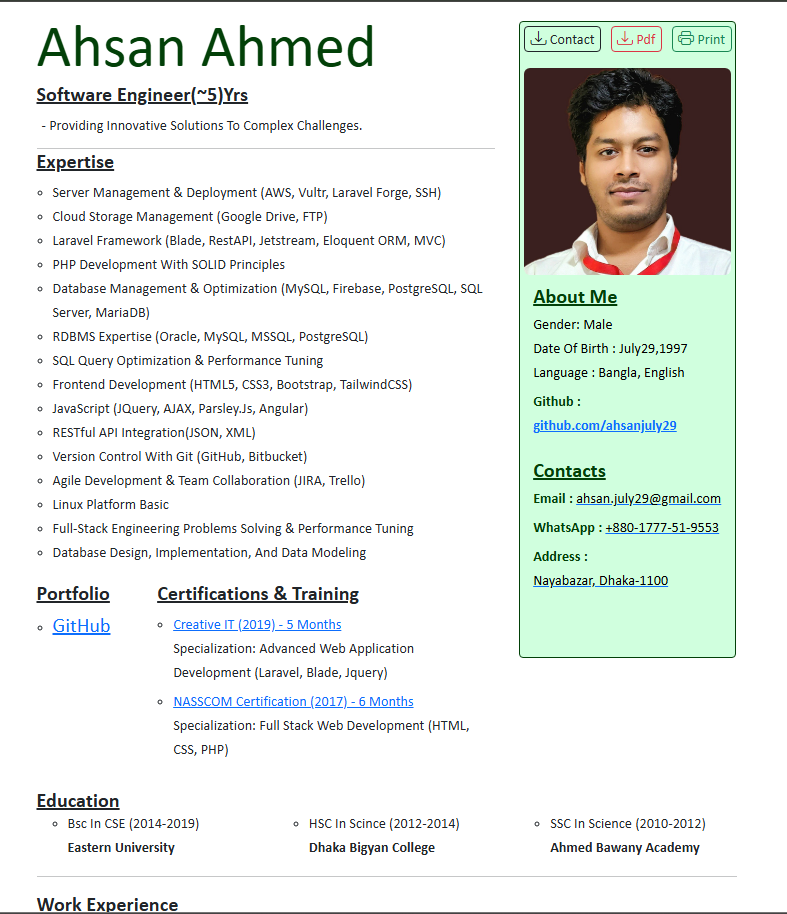

# My CV

This repository contains the code for my personal CV website, built using HTML and CSS. It showcases my professional experience, education, skills, and personal projects in a simple, responsive, and elegant design.

## Preview



## Features

- **Personal Information**: Basic details like name, contact information, and a short bio.
- **Professional Experience**: A list of past jobs and roles with descriptions of responsibilities and achievements.
- **Education**: Details about academic qualifications.
- **Skills**: A section dedicated to technical and soft skills.
- **Projects**: Highlighting personal and professional projects, along with links to GitHub repositories where relevant.
- **Responsive Design**: The CV is fully responsive and adapts to different screen sizes.

## Technologies Used

- **HTML**: For structuring the content of the CV.
- **CSS**: For styling and ensuring a responsive design.

## How to View

You can view the live version of the CV by cloning the repository and opening `index.html` in any web browser.

### Steps to Run Locally

1. Clone and paste on Browser or <a href="https://ahsanjuly29.github.io/Mycv/" target="_blank">click here</a>:
   ```bash
   https://ahsanjuly29.github.io/Mycv/
   ```
      
## License

This project is licensed under the MIT License - see the [LICENSE](LICENSE) file for details.
